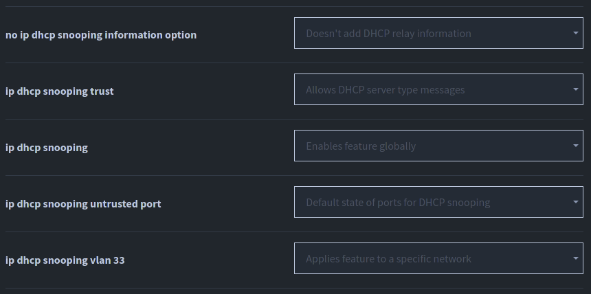

# DHCP Snooping #

## What is DHCP Snooping and why does it matter? ##

- Let's imagine somebody has breached your network and has setup a PC or software in your network that responds to DHCP requests.
- John Wayne, who works for E-Corp returns with his laptop on Monday morning and wants to connect to the company network. He needs an IP address so his computer sends out a DHCPDISCOVER message.
- The attacker's PC (software), acting as a DHCP server, replies to the DHCPDISCOVER with a DHCPOFFER.
- John Wayne's computer accepts the offer and gets a legit IP address for the subnet and a correct subnet mask, but the default router (gateway) is the attackers PC, not the legitimate default gateway. Hence, all network traffick generated by John Wayne flows through the attackers PC, creating a man-in-the-middle attack. John Wayne has no idea since everything works on his end because the attacker forwards the traffic to the legit router but he keeps a copy of anything sent by John Wayne on his machine.
- This only works if the attackers PC responds before the legit DHCP server responds. The legit DHCP server will still get the DHCPREQUEST message, and reply with a DHCPOFFER but if the attacker is first, the offer will be declined by John Wayne's PC. 

//Insert WP block seperator.
&nbsp;
## DHCP Snooping - How does it work? ##

- While DHCP itself provides a Layer 3 service, DHCP Snooping operates on LAN switches and is commonly used on Layer 2 LAN switches and enabled on Layer 2 ports.
- By enabling DHCP snooping, you are telling the switch to ignore all DHCP server meessages on ports that are not explicitly trusted. You must tell the switch what specific port leads to the real DHCP server, that port needs to be trusted. **Ports are either trusted or untrusted**. On a trusted port, DHCP messages will be forwarded; trusted ports do not filter any DHCP messages. DHCP messages received on an untrusted port, messages normally sent by a server will always be discarded.


- It's helpful to understand how the DHCP process flows. A handy way to remember it is to remember DORA: Discover, Offer, Request, Acknowledge.
  - Clients send Discover and Request.
  - Servers send Offer and Acknowledgement.

### The filtering process ####

- DHCP Snooping does a simple check for the most common client-sent messages: DISCOVER and REQUEST. DHCP messages define the chaddr (client hardware address or MAC address) field to identify the client. All hosts on LANs include the device's MAC address as a part of the chaddr. Ethernet hosts encapsulate the DHCP messages inside Ethernet frames, and those frames include a source MAC address. That add MAC address should be the same MAC address used in the DHCP chaddr field, so DHCP Snooping compares the these two values to make sure they are the same.

### DHCP Snooping Binding Table ###

- DHCP Snooping builds the DHCP Snooping table for all the DHCP flows it sees that it allows to complete. This table has some important facts for any working legitimate DHCP flows.
- DHCP clients can send two more messages, not only Discover and Request, but also Release and Decline. An attacker can fake a DHCP Release message to the DHCP server. If the DHCP client doesn't need the IP address anymore, it can send a DHCP Release message to the DHCP server, and DHCP snooping on the switch compares the incoming message, incoming interface, and the entries in the Snoop Binding table before forwarding the message. The message is discarded if all of these don't match with the DHCP Snooping binding table. 

//Insert WP block seperator.

## Commands ##

- You need issue a global command to enable DHCP Snooping.
- ```ip dhcp snooping``` Enables DHCP snooping.
- ```sh dhcp snooping```
- ```ip dhcp snooping vlan 1```
- ```sh dhcp snooping```
- ```no ip dhcp snooping information option``` This disables option 82. To enable DHCP snooping on a trusted interface. Go into the interface: conf t then the interface: int fa0/1. Then enable that port as a trusted DHCP port.
- ```ip dhcp snooping trust``` That's now a trusted DHCP port.
- ```sh dhcp snooping binding``` To see leases.



## Source Guard ##

- ```ip verify source port security```This verifies both the source ip and MAC address.
- ```show ip verify source```